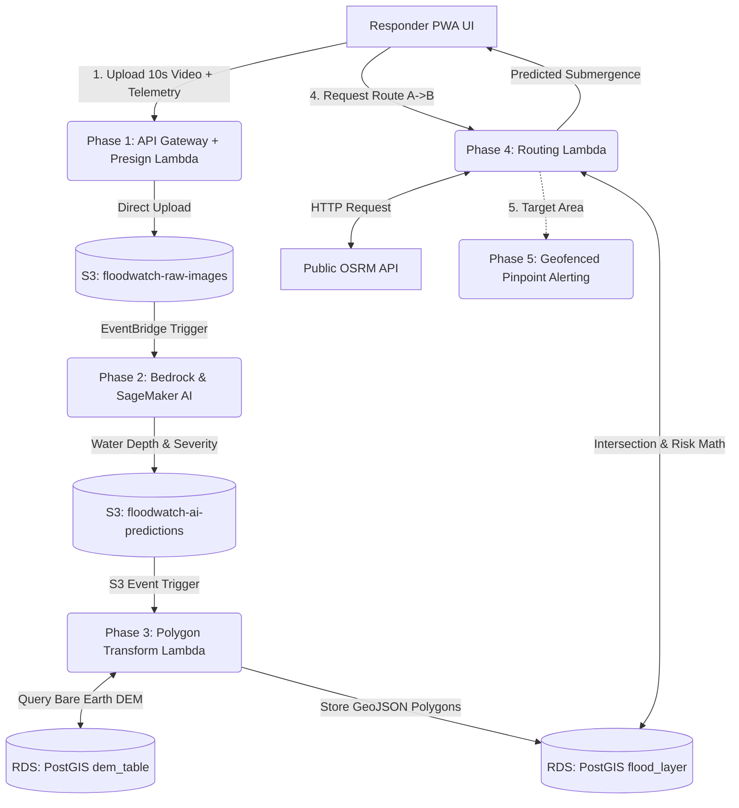

# FloodWatch AI: Comprehensive Handover & Deployment Manual

This is the definitive, exhaustive guide for deploying the **FloodWatch AI** platform in a brand-new AWS account. It covers the entire 5-phase architecture, exact IAM policies, API signatures, database schemas, and critical lessons learned during initial development.

---

## 🏗️ 1. Architecture Map (The 5 Phases)

FloodWatch AI is a multimodal, serverless mapping and routing platform for disaster response.



### Phase Details & Implementation Status

| Phase | Description | Status in Current Codebase |
| :--- | :--- | :--- |
| **Phase 1: Edge Ingestion** | Progressive Web App (PWA) capturing 10s video, GPS, heading, and pitch/yaw telemetry. Direct-to-S3 uploads via presigned URLs. | ✅ Fully built (Frontend JS + `lambda_presign`) |
| **Phase 2: Multimodal AI** | Amazon Bedrock (Nova) for semantic context + Amazon SageMaker (YOLOv8/SAM) for water depth estimation using reference objects. | 🟡 Mocked via `processFloodAI` Python script. Needs real Bedrock/SageMaker integration. |
| **Phase 3: Live DTM GIS** | Queries PostGIS `dem_table` (bare-earth). Adds AI liquid depth to base elevation to map dynamic `water_surface_elevation` polygons. | ✅ Fully built (`transformFloodPolygon` + RDS PostGIS) |
| **Phase 4: Hydro Routing** | Calculates physics-based water spread via DEM. Queries OSRM road graph. Math intersection via `Shapely` sets flooded road weights to infinity. | ✅ Fully built (`routingLambda` + Public OSRM API + PostGIS) |
| **Phase 5: Mass Alerting** | Geofences affected users via DB query. Amazon Pinpoint triggers localized voice/SMS dispatch using Amazon Polly. | ❌ Planned future expansion. |

---

## 🗄️ 2. Database Blueprint (Amazon RDS PostgreSQL)

**Infrastructure Required:** 1x Amazon RDS PostgreSQL (e.g., `t3.micro` or `t4g.micro`), Minimum version 14.
**CRITICAL:** Must have **Public Access = Yes** attached to a Security Group allowing inbound `5432` from `0.0.0.0/0`. (See "Key Learnings" below on why Lambdas shouldn't be in VPCs).

### Exact Schema SQL
Run this exactly as-is in your new database using pgAdmin or DBeaver:

```sql
-- 1. Enable PostGIS Extension (Required!)
CREATE EXTENSION IF NOT EXISTS postgis;

-- 2. Phase 3: Observed Floods (Generated from Video/AI)
CREATE TABLE IF NOT EXISTS flood_layer (
    id SERIAL PRIMARY KEY,
    geom geometry(Polygon, 4326),
    submergence_ratio DOUBLE PRECISION,
    severity VARCHAR(50),
    timestamp TIMESTAMP WITH TIME ZONE DEFAULT CURRENT_TIMESTAMP,
    water_surface_elevation DOUBLE PRECISION,
    source_image VARCHAR(255)
);
CREATE INDEX IF NOT EXISTS flood_layer_geom_idx ON flood_layer USING GIST(geom);
CREATE INDEX IF NOT EXISTS flood_layer_timestamp_idx ON flood_layer(timestamp);

-- 3. Phase 3 & 4: DEM Terrain Baseline (You must import elevation data here)
CREATE TABLE IF NOT EXISTS dem_table (
    id SERIAL PRIMARY KEY,
    geom geometry(Point, 4326),
    elevation_m DOUBLE PRECISION
);
CREATE INDEX IF NOT EXISTS dem_table_geom_idx ON dem_table USING GIST(geom);

-- 4. Phase 4: Predicted Flood Expansion
CREATE TABLE IF NOT EXISTS flood_prediction (
    id SERIAL PRIMARY KEY,
    geometry geometry(Polygon, 4326),
    submergence_ratio DOUBLE PRECISION,
    velocity DOUBLE PRECISION,
    timestamp TIMESTAMP WITH TIME ZONE DEFAULT CURRENT_TIMESTAMP,
    source VARCHAR(50)
);
CREATE INDEX IF NOT EXISTS flood_prediction_geom_idx ON flood_prediction USING GIST(geometry);

-- 5. Phase 4: Road Risk Cache (Optional optimization)
CREATE TABLE IF NOT EXISTS road_risk (
    id SERIAL PRIMARY KEY,
    road_segment_id VARCHAR(100) UNIQUE,
    geometry geometry(LineString, 4326),
    base_weight DOUBLE PRECISION,
    dynamic_weight DOUBLE PRECISION,
    max_submergence DOUBLE PRECISION,
    is_closed BOOLEAN,
    updated_at TIMESTAMP WITH TIME ZONE DEFAULT CURRENT_TIMESTAMP
);
CREATE INDEX IF NOT EXISTS road_risk_geom_idx ON road_risk USING GIST(geometry);
```

---

## 🚀 3. Serverless Functions (AWS Lambda) Detailed Spec

To deploy these functions successfully, you MUST create a **Lambda Layer** containing `psycopg2-binary` and `Shapely` (compiled for Python 3.12, Amazon Linux 2023 architecture).

### Lambda 1: `lambda_presign` (Phase 1)
*   **Purpose:** Generates secure temporary upload URLs for the PWA so videos go directly to S3 without passing through backend servers.
*   **Runtime:** Python 3.12
*   **VPC:** None.
*   **Environment Variables:**
    *   `BUCKET_NAME`: `floodwatch-raw-images`
*   **IAM Policy Required:**
    ```json
    {
      "Version": "2012-10-17",
      "Statement": [
        {
          "Effect": "Allow",
          "Action": ["s3:PutObject", "s3:PutObjectAcl"],
          "Resource": "arn:aws:s3:::floodwatch-raw-images/*"
        }
      ]
    }
    ```

### Lambda 2: `processFloodAI` (Phase 2)
*   **Purpose:** The entrypoint for Bedrock/SageMaker. Currently holds mock logic that reads the S3 upload and outputs a simulated 'prediction' JSON.
*   **Runtime:** Python 3.12 (or Node.js 20.x)
*   **VPC:** None.
*   **Trigger:** Amazon EventBridge Rule: `source: aws.s3`, `bucket: floodwatch-raw-images`, `event: Object Created`.
*   **IAM Policy Required:**
    ```json
    {
      "Version": "2012-10-17",
      "Statement": [
        {
          "Effect": "Allow",
          "Action": "s3:GetObject",
          "Resource": "arn:aws:s3:::floodwatch-raw-images/*"
        },
        {
          "Effect": "Allow",
          "Action": "s3:PutObject",
          "Resource": "arn:aws:s3:::floodwatch-ai-predictions/*"
        }
      ]
    }
    ```

### Lambda 3: `transformFloodPolygon` (Phase 3)
*   **Purpose:** Consumes the Phase 2 AI output, converts the depth estimate to a GeoJSON polygon, cross-references with `dem_table` in PostGIS, and inserts it into `flood_layer`.
*   **Runtime:** Python 3.12 + PostGIS/Shapely Layer
*   **VPC:** None (Connects to public RDS endpoint).
*   **Trigger:** Amazon S3 Event Notification on `floodwatch-ai-predictions` (Object Created).
*   **Environment Variables:**
    *   `DB_HOST`: `<Your-RDS-Endpoint>`
    *   `DB_PORT`: `5432`
    *   `DB_NAME`: `floodwatch`
    *   `DB_USER`: `postgres`
    *   `DB_PASS`: `<Your-Password>`
*   **IAM Policy Required:** Basic execution role + S3 GetObject on `ai-predictions`.

### Lambda 4: `routingLambda` (Phase 4)
*   **Purpose:** Core routing engine. Performs DEM-based hydrodynamic propagation, fetches OSRM route, runs Shapely intersection against PostGIS floods, returns risk status to UI.
*   **Runtime:** Python 3.12 + PostGIS/Shapely Layer
*   **VPC:** **Absolutely NONE**. Must have public internet access.
*   **Environment Variables:**
    *   `DB_HOST`, `DB_PORT`, `DB_NAME`, `DB_USER`, `DB_PASS` (Same as Phase 3)
    *   `FLOODWATCH_DB_MODE`: `production` *(Tells code not to use memory mocks)*
    *   `OSRM_MOCK`: `0`
    *   `OSRM_ENDPOINT`: `https://router.project-osrm.org`

---

## 🌐 4. API Gateway Routes (HTTP API)

Create an API Gateway (HTTP API type) and configure CORS:
*   `Access-Control-Allow-Origin`: `*`
*   `Access-Control-Allow-Methods`: `GET, POST, OPTIONS`

**Routes to set up:**
1.  `GET /upload-url` ➡️ Integrates with `lambda_presign`
2.  `GET /route` ➡️ Integrates with `routingLambda`
    *   Expected query string: `?start=lat,lon&goal=lat,lon`

---

## ⚠️ 5. Critical Account Migration Guide & Lessons Learned

If you blindly migrate the codebase without understanding *why* certain decisions were made, it will fail. Read these carefully:

### Lesson A: Do NOT attempt the EC2 OSRM Deployment
During development, we attempted to host the OSRM routing engine on an EC2 instance. 
*   **Why it failed:** OSRM processing requires massive RAM (`bad_alloc` crashes on `t3.medium`). Furthermore, managing custom VPC subnets, automated User Data scripts, and SSH key pairs (`.pem` loss) caused days of blockers.
*   **The Mandate:** For Phase 4 to work reliably, you **must use the public OSRM API** (`https://router.project-osrm.org`). 

### Lesson B: Lambda VPC Traps
If you place a Lambda inside a default VPC (usually done to connect to a private RDS instance), **that Lambda loses all outbound internet access.**
*   **The Impact:** `routingLambda` would be unable to call `router.project-osrm.org`, resulting in instant timeouts.
*   **The Solution:** Do **not** put Lambdas in a VPC. Keep them in the default Lambda networking pool. Instead, make your RDS instance **Publicly Accessible** and secure it via a strong password and Security Group IP whitelisting. (Alternatively, pay $32/mo for a NAT Gateway, which we avoided).

### Lesson C: Populating DEM Data is Mandatory
In Phase 3 and 4, the code calculates `water_surface_elevation` and hydrodynamic propagation by querying the `dem_table`. 
*   **Action Required:** In the new account, the `dem_table` will be empty. You must write a script to download SRTM or Copernicus DEM data for your target region (e.g., Chennai) and insert it as ST_Points into that table. If the table is empty, the python logic will silently fallback to drawing random circular buffers, heavily degrading accuracy.

---

## 📋 6. Step-by-Step Bring-Up Plan (New Account)

1.  **S3:** Create buckets (`floodwatch-raw-images`, `floodwatch-ai-predictions`). Configure CORS on `raw-images`.
2.  **Database:** Launch RDS Postgres. Enable Public Access. Run SQL Schema. Ingest DEM data for your city.
3.  **Layers:** Compile the `psycopg2-binary` and `shapely` dependencies into a Lambda Layer zip.
4.  **Compute:** Deploy the 4 Lambda functions. Attach the layer. Set environment variables. Verify NO VPC attachments.
5.  **Networking:** Create HTTP API Gateway. Wire up the `/upload-url` and `/route` endpoints.
6.  **Eventing:** Set up S3 Event Notifications to trigger the Phase 2 and Phase 3 lambdas.
7.  **Frontend:** Update `app.js` with your new API Gateway URL and host the PWA on AWS Amplify or GitHub Pages.
